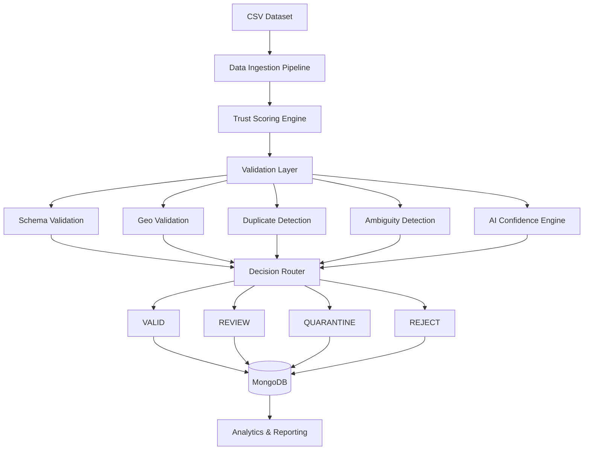

<p align="center">
  
</p>

<div align="center">

# 🚀 Validation Engine

### AI-Powered Data Validation, Deduplication & Trust Scoring Platform

<p>
High-performance data quality platform for validating, enriching, classifying, deduplicating and trust-scoring large-scale cemetery datasets.
</p>

<p>


</p>

</div>

---

# 📌 Overview

Validation Engine is a scalable data-quality platform built to process, validate, enrich, and classify cemetery records at scale.

The system combines traditional rule-based validation with machine learning, geospatial intelligence, duplicate detection, trust scoring, and automated reporting to ensure only high-quality records enter the database.

Each record is automatically evaluated and routed into one of four processing states:

| Status        | Description                             |
| ------------- | --------------------------------------- |
| ✅ VALID       | Trusted and automatically accepted      |
| ⚠️ REVIEW     | Requires human verification             |
| 🔒 QUARANTINE | Flagged as suspicious or low confidence |
| ❌ REJECT      | Fails critical validation requirements  |

---

# 🎯 Problem Statement

Large cemetery datasets often contain:

<table>
<tr>
<td>🔄 Duplicate Records</td>
<td>📍 Invalid Coordinates</td>
</tr>

<tr>
<td>⚠️ Missing Metadata</td>
<td>❓ Ambiguous Locations</td>
</tr>

<tr>
<td>🚫 Incorrect Classification</td>
<td>📉 Low Confidence Data</td>
</tr>

<tr>
<td>🗂 Inconsistent Formatting</td>
<td>🌎 Geographic Errors</td>
</tr>
</table>

These issues significantly reduce data quality and increase manual review effort.

Validation Engine automates detection, correction, enrichment, classification, and routing of problematic records.

---

# 🏗 System Architecture



---

# 🌟 Core Features

## 🔍 Smart Validation

Performs comprehensive validation including:

* Schema validation
* Required field verification
* Missing data detection
* Coordinate verification
* Data normalization
* Completeness analysis
* Consistency checks

---

## 🌍 Geospatial Intelligence

Advanced location validation capabilities:

* Coordinate validation
* Reverse geocoding
* State verification
* Boundary validation
* Location consistency checks
* Geographic confidence scoring

---

## 🔄 Duplicate Detection Engine

Identifies duplicate records using:

* Exact matching
* Fuzzy string matching
* Geographic proximity matching
* Similarity scoring
* Canonical record generation
* Duplicate clustering

---

## 🧠 AI & Machine Learning

Machine learning assisted validation:

* Confidence scoring
* Record classification
* Duplicate prediction
* Trust estimation
* Validation intelligence
* Automated decision support

---

## 📊 Trust Score System

Every record receives a trust score based on:

* Data completeness
* Source reliability
* Geographic accuracy
* Historical validation success
* Duplicate probability
* Classification confidence

---

# 🛠 Technology Stack

| Layer                | Technology                |
| -------------------- | ------------------------- |
| Programming Language | Python 3.11               |
| Database             | MongoDB                   |
| Data Processing      | Pandas                    |
| Numerical Computing  | NumPy                     |
| Machine Learning     | Scikit-Learn              |
| Geospatial Services  | OpenStreetMap / Nominatim |
| Concurrency          | ThreadPoolExecutor        |
| Reporting            | JSON / CSV                |
| Storage              | BSON / MongoDB            |

---

# 🚀 Performance Optimizations

## Multi-threaded Deduplication

Implemented parallel duplicate scanning to improve throughput and reduce validation latency.

### Benefits

* Faster processing
* Improved scalability
* Better CPU utilization
* Reduced runtime

---

## Validation Cache

Caching layer prevents repeated expensive validation computations.

### Benefits

* Reduced API calls
* Faster repeated validations
* Lower processing cost

---

## MongoDB Indexing

Optimized indexing strategy for rapid record lookup and duplicate detection.

### Benefits

* Faster search operations
* Efficient duplicate retrieval
* Better query performance

---

## Batch Processing

Records are processed in batches rather than individually.

### Benefits

* Reduced database overhead
* Lower memory consumption
* Improved throughput

---

# 📂 Project Structure

```bash
validation_engine/
│
├── validation_engine/
│
├── services/
│   ├── ingestion_service.py
│   ├── trust_service.py
│   ├── duplicate_service.py
│   ├── geo_service.py
│   └── ai_validation_service.py
│
├── models/
│   ├── classifier.py
│   ├── duplicate_model.py
│   └── confidence_model.py
│
├── validators/
│   ├── schema_validator.py
│   ├── geo_validator.py
│   └── duplicate_validator.py
│
├── reports/
│
├── db/
│
├── utils/
│
├── Final_states_data/
│
├── OPTIMIZATION_VALIDATION.md
├── TODO.md
└── README.md
```

---

# 🔄 Validation Workflow

```text
Load Dataset
      │
      ▼
Normalize Records
      │
      ▼
Trust Score Calculation
      │
      ▼
Validation Engine
      │
      ├── Schema Validation
      ├── Geo Validation
      ├── Duplicate Detection
      ├── Ambiguity Detection
      └── AI Confidence Analysis
      │
      ▼
Decision Routing
      │
      ▼
MongoDB Storage
      │
      ▼
Analytics & Reports
```

---

# 📊 Sample Output

```json
{
  "record_id": "12345",
  "status": "VALID",
  "trust_score": 92.7,
  "duplicate_probability": 0.04,
  "confidence": 0.96,
  "classification": "Verified Cemetery",
  "reason": "Passed all validation checks"
}
```

---

# 🎯 Future Roadmap

* [x] Validation Pipeline
* [x] Trust Scoring
* [x] Duplicate Detection
* [x] MongoDB Integration
* [x] Multi-threaded Processing
* [ ] REST API
* [ ] FastAPI Dashboard
* [ ] Real-Time Validation Service
* [ ] Distributed Processing
* [ ] Kubernetes Deployment
* [ ] Vector Similarity Search
* [ ] LLM Assisted Record Resolution
* [ ] Automated Model Retraining

---

# 📈 Why This Project Matters

This project demonstrates practical software engineering and data engineering concepts:

✅ Large-Scale Data Validation

✅ Machine Learning Integration

✅ MongoDB Database Design

✅ Geospatial Processing

✅ Concurrent Programming

✅ High-Performance Data Pipelines

✅ AI-Assisted Decision Systems

✅ Production-Ready Architecture

It serves as a strong portfolio project for:

* Backend Engineering
* Data Engineering
* Machine Learning Engineering
* Platform Engineering
* Data Quality & Governance

---

<div align="center">

# 👨‍💻 Author

### Aayush60-del

Data Engineering • Machine Learning • Backend Systems

⭐ Star the repository if you found it useful.

</div>
